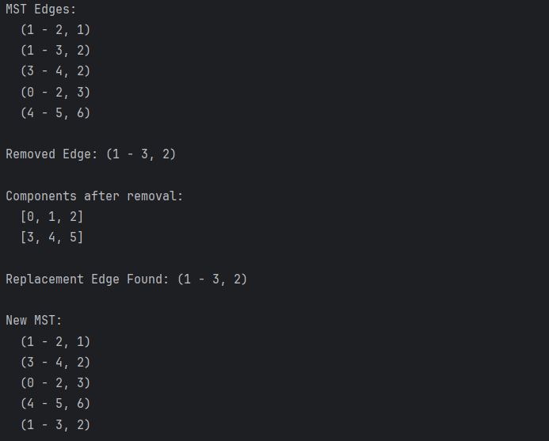

# Edge Removal from an MST
**Name:** Arstanbek Fariza  
**Group:** SE-2424

## Project Overview

This project implements the Minimum Spanning Tree (MST) problem using Kruskal’s algorithm with an additional feature — the ability to remove an edge and find a replacement edge to maintain graph connectivity.
It demonstrates the use of Disjoint Set Union (Union-Find) data structure for efficient cycle detection and connected component tracking.

## Main Objectives

- Build a Minimum Spanning Tree (MST) from a weighted undirected graph.
- Efficiently manage disjoint sets to detect and prevent cycles.
- Allow edge removal from the MST.
- Automatically find and add a replacement edge that reconnects components with the smallest possible weight.
- Display the updated MST and connected components after changes.

## Class Structure

- Edge.java

Represents a single connection (edge) between two vertices in a weighted, undirected graph.
This class provides the basic building block for the graph and MST algorithms.

- DisjointSet.java

Implements the Disjoint Set Union (DSU) or Union-Find data structure,
used to efficiently detect cycles and maintain sets of connected vertices.
This class ensures efficient cycle detection and component merging in Kruskal’s algorithm.

- Graph.java

Represents a weighted, undirected graph as a collection of vertices and edges.
This class acts as a data container that holds all graph information needed by the MST algorithm.

- MSTManager.java

This is the core logic class responsible for:
Constructing the MST using Kruskal’s algorithm.
Managing dynamic updates.
Displaying results.
This class integrates Kruskal’s algorithm with extra functionality for interactive MST management.

## Algorithm Explanation
**Kruskal’s Algorithm (Used in buildMST)**

1. Sort all edges by weight.
2. Initialize each vertex as its own disjoint set.
3. For each edge (u, v):
4. If find(u) != find(v), add the edge to MST and merge sets.
5. Stop when MST contains V - 1 edges.

**Edge Removal and Replacement**

1. Remove the selected edge from MST.
2. Rebuild disjoint sets to find current components.
3. Search through all graph edges for the smallest edge that connects two separate components.
4. Add that edge to MST as a replacement.

## Example Output

## Conclusion

This project provides a clear and functional implementation of the Minimum Spanning Tree (MST) problem using Kruskal’s algorithm.
It not only constructs an MST but also demonstrates advanced graph management through edge removal and replacement detection.
The modular code structure and testing ensure reliability and extensibility for further research and applications in graph theory and network optimization.